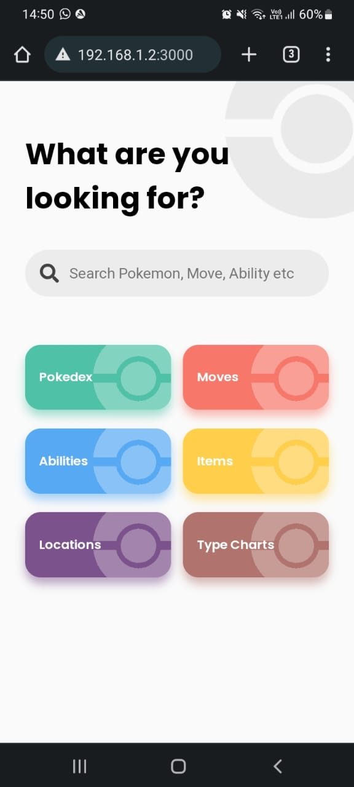
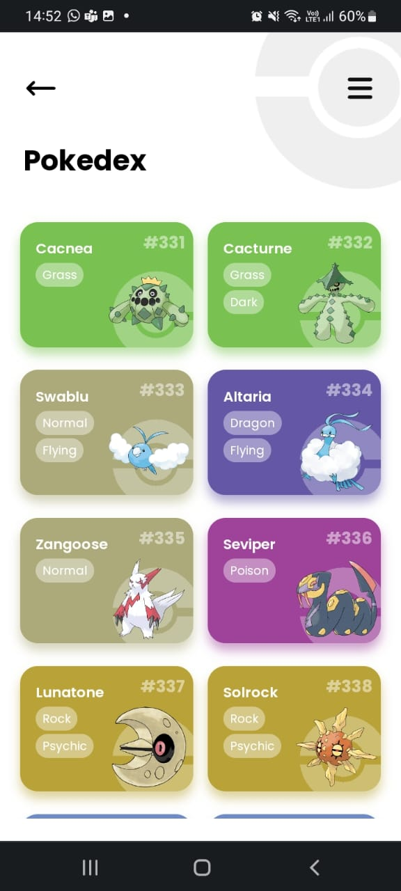
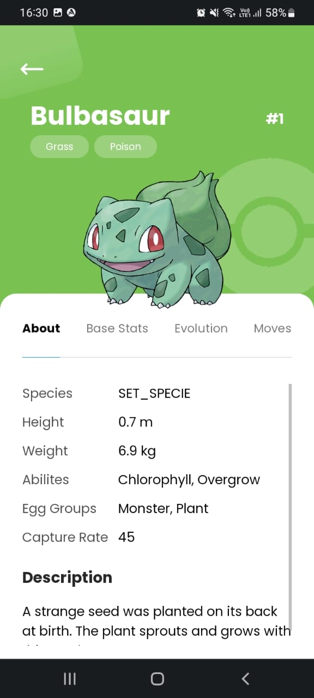

# Pokedex com React

  

Um projeto de Pokedex feito com React, TypeScript e SASS.

## Novos Conhecimentos

Usei esse projeto pra melhorar alguns conhecimentos que já tinha e para ganhar alguns novos. Um dos novos conhecimentos foi o de consumir APIs feitas em GraphQL, que no caso foi a versão beta da PokeAPI. Outro conhecimento foi o de utilizar a API IntersectionObserver pra fazer um scroll infinito (não tão infinito já que a quantidade de pokemons é finita kkkk) e o de começar a desenvolver a interface para celulares antes de para desktops (o famoso mobile first). Foi divertido de aprender, mas a parte de GraphQL foi um pouquinho confusa já que tô bem acostumado a consumir APIs REST.

Como deu praticamente tudo certo e já pude colocar em prática os novos conhecimentos, acabou faltando dar um polimento na aplicação, melhorar o design pra desktop e colocar algumas telas simples. Mas como isso eu já sei e não é algo tão legal de se fazer, vou deixar em standby por enquanto 😋

## Prints

 

 

 